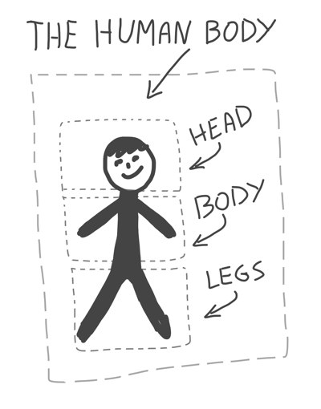
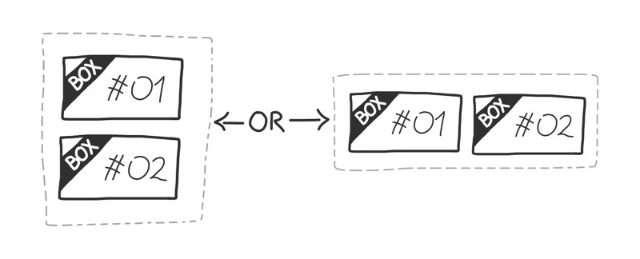

Everithing Is A Box
===================

When you first approach the art of **converting a design to a web page**
you really need to **understand that everything is a box**. 

I really mean it, for both web design and the real world outside 
your window. Take a look!

> &raquo; **with HTML** we are going to use `div` to represent boxes.
> 
> A `div` is normally rendered as a real squared or rectangular area on 
> browser's page so the concept of _"BOX"_ is a good metaphor to use in web design.
> <small>(and computer science)</small>

## Simplify It!

Every complex image or object from reality should be simplified to a set of boxes 
which are in relation one to each others.

The image above display a person (I really tried to draw a person!) which is a
very complex object from the real world.

I’m far to understand how the human body works but I can move a step 
toward that knowledge by simplify the problem. I should say:

- my HEAD is responsible of getting food
- my BODY is responsible of using food to make power
- my LEGS are responsible of using power to bring me seeking for food

I still far to fully comprehend the human body but I can happily affirm
that now I know something more than before. 

> Remember: **to solve a problem** is very a different job than 
> **to find a solution** for that problem!

## Relations Between Boxes

As soon as you begin to simplify complex objects into boxes you discover **you need to describe the relation** from one box to the others. 

> Remember we are talking about to cut a graphic image into a _web page_!   
> **We are not making rocket science here!**

Luckily there are very few way we can organize boxes, the first two of them I call **strong relations**, the last one I call **soft relation**.

A **strong relation** exists since the box is being created and **can't change**: 

> I was born **before** my brother, there is no way to change this **order relation**.

A **soft relation** concern the appeareance of things and **should change in time**.

> Today **I'm more fat** than my brother but I really can put all my effort to 
> change this **soft relation**!

Moving the discussion to _web design_, which is the subject of this paper, we can say:

> - strong relations are built within **HTML**
> - soft relations are built within **CSS**

### Parent / Child - Nesting Relation

The _parent / child_ relation define **who contains who**.

`Box A` should contain `Box B`, so i can say:

- `Box A` is `Box B`'s **CONTAINER**
- `Box B` is `Box A`'s **CONTENT**

It's important to understand than **one box can have one and only one container** like a human being should have one and only one biological father.

> Luke, I am your father!  
> <small>(Darth Vader)</small>

It is always simple and quite natural for a box to identify it's container.

    // parent / child example
    

        

    

    
Looking at the code above is quite simple to understand that:

- `#box1` is the **parent** of `#box2`
- `#box2` is the **child** of `#box1`

> A good use of **code indentation** make the _parent / child_ relation ridicolous explicit!

### Before / After - Order Relation

On the other side a box should contain many other boxes.  
To be able to identify one particolar box between those contained I should say:

> _"Give me the `box N.3` from `BoxA`"_

We use this is the second _strong relation_ to simplify a complex object into a lists of simple boxes.

This **order relation** is something related with the **importance of a box**.  
<small>The more important is the first it come.</small>

> If you think to your bedroom's chest then the "first drawer" is also the first box 
> which have been placed inside it.

Given a box you can use this relation **to identify adjacent boxes**.

    // before / after example
    

        

        

        

    

    

        

        

    

    
Looking at the code above is quite simple to understand that:

- `#box1` precede `#box2` (before)
- `#box3` follow `#box2` (after)
- `#box2` is preceded by `#box1` and followed by `#box3`
- `#box1` and `#box3` are siblings of `#box2`
- `#chest1` precede `#chest2`
- `#box3` and `#box4` has ho _direct_ strong relations!

> Thanks to **code indentation** it's easy to detect the _order relation_ among items 
> which share the same container because **they are on the same code column**!

### Left / Right - Layout Order

The _left / right_ relation is a **soft relation** because regards **how boxes are arranged into an horizontal space** which is not a strong hierarchical organization. 

> In _web design_ we use this relation to implement **layouts**.

It is really important to understand that _left / right_ relation **does not depend** on _before / after_ relation. It is a relation which i**s built upon visual rules** such CSS rules:

Image above show how a strong _before / after_ relation (on the left) should be arranged in two different _left / right_ relations.

> A change in a _left / right_ relation should never affect an existing _before / after_ relation!

    // left / right example
    

        

        

    

    
    // right / left example
    

        

        

    

Code above show how the HTML structure of the two different implementation does not change. Both _nesting_ and _order_ relations still, **only _CSS_'s _style_ attribute change**.

## Rows or Columns?

> Because we are dealing with a browser, then life it's really easy for us!  
> <small>(at least at the analysis level!)</small>

All browsers use a really simple metaphor to render contents to the screen: [the Box Model](https://developer.mozilla.org/en-US/docs/Web/CSS/box_model).

This fact means that we need **to simplify the complex designs to a list of boxes and relations between boxes**.

We already learned about which relations should exists between boxes, now it's time to take a shortcut **to cut off our analysis time**.

> Every box's contents should be arranged in only one way:  
> **or ROWS or COLUMNS**!

There is no way for a browser to render a mix of rows and columns, all we have to do to convert a design to an HTML is to:

- identify the bigger box within the design
- understand if it contains rows or columns
- draw all child boxes
- **repeat the analysis for each child box**

Image above show how we can simplify a complex web design to a list of boxes level by level.

In the **first level** we can identify two lines which slice the image into three rows. Then we **step into the first row** and we analyze that logo and menu are **two boxes placed one beside the other**, the logo is on the left hand, the menu on the right hand. Then we **move into the secondo row** of the first level ...

    // page structure with strong relations
    

      

        
LOGO

        
MENU

      

      

        
ARTICLE

        
SIDEBAR

      

      

        
INFO

        
INFO

        
INFO

        
INFO

      

    

Code above show how we can convert a design analysis into an _HTML source code_. So far we are dscribing with _HTML tags_ the boxes and the _strong relations_ which exists between those boxes.

> **At this step we take care of:**
> 
> - nesting childs into containers 
> - to give the right order to siblings boxes

**IMPORTANT:**  
brake down your temptation to assign classes and use more refined _HTML5 tags_.  
So far **you must focus only on strong relations** and the very bare structure of the page.  
<small>This is **WHY** we use only _DIVs_ in this step!</small>