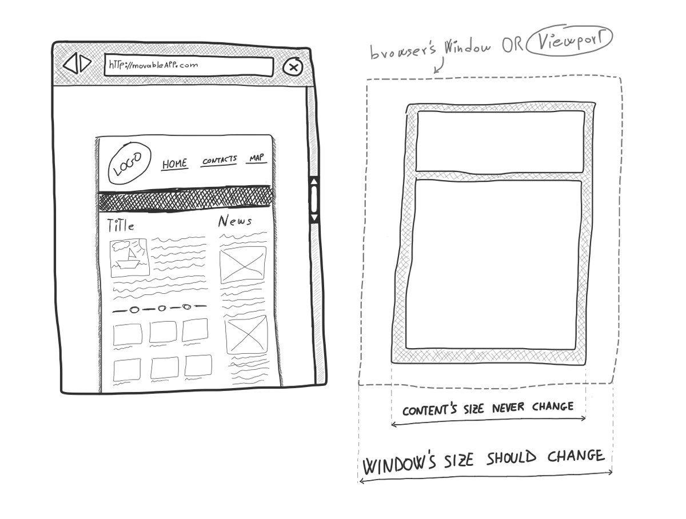
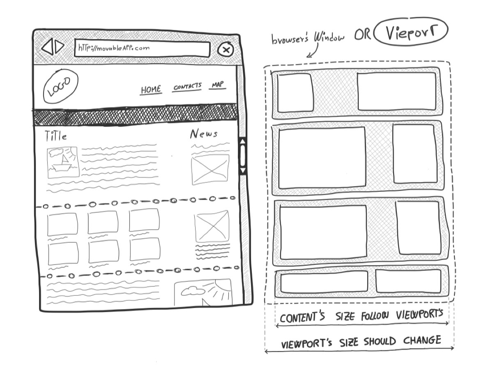

Web Page Layouts
================

The the generic word **"layout"** identify **how box contents should be arranged** in relation to the available space.

We can talk about the layout of any box at any nested level within a web page, but the pourpose of this article is to circumscribe the discussion to the overall **layout of a web page**. 

In any web page we can identify **a box which seems to wrap around all the page's contents**. We should call this box **"main container"** because by analyzing this box we can **identify the web page layout**.

> When we talk about **"web page layout"** then we mean **how the page's 
> main container behave responding to the _viewport_'s behavior**.
>
> <small>The _**web page's viewport**_ is the portion of the browser's 
> window available to page's contents to be rendered.</small>

There are _two main families_ of web page layouts - **boxed layouts** and **fluid layouts** - with which we identify two radical differnt approaches in using viewport's available space. 

Then we can mix those families to obtain many different **hybrid layouts** whom combine properties from both original families.

## Boxed Layout, Fix Layout

This is the most common web page layout because it's quite simple to deal with. It's main property is the **fixed dimension of the main container** which make possible to set very precise dimensions for images, columns and other UI components.

    // HTML
    

        
Box A

        
Box B

    

    
    // CSS
    .container {
        width: 800px;
        margin: auto;
    }

The most of the time this layout appear to be a paper centered to the browser's viewport. Content's background contrasts so much with the overall background and very often a border is visible.

> This layout it is easy to identify when you try to resize your browser's window:  
> **contents width still while margins dimension change**.

A boxed layout is very often used for web sites and landing pages mostly because dimensions inside the content wrapper never change so **it is possible to cut out very articulated graphics** into slices and put all toghether inside the resulting page.

## Fluid Layout

In a _fluid layout_ **contents dimensions follow the viewport dimensions**. Contents fill all available horizontal space and adapt from very little to very large _viewport_ sizes.

> This is the layout of _web apps_ and _mobile web sites_. 

A **web app** - like GMail - need to show a lot of things: menus, panels, informations boxes, contents so it need all available space to be uses in a very smart way. 

On the other side a **mobile web site** should expose simple contents but in a very little display so it also need all available space.

    // HTML
    

        
Box A

        
Box B

    

    

        
Box C

        
Box D

    

    
    // CSS
    .container {
        width: auto;
        margin-left: 50px;
        margin-right: 50px;
    }

In code above we use some _containers_ which spread to all available horizontal space but for a fixed margin. Then we can use those containers to implement some left/right columns with _float_ or _flexbox_.

A fluid layout is quite difficult to implement in a _web page_ who's target is the desktop because very large text contents are quite difficult to real.

> Most of the time **this layout is used in combination with _media query_** to better adapt
> to many different device sizes.

## Fluid Boxed Layout

This probably is the most important **hybrid layout** which is used today by literally millions of websites.

It's pourpose is to create the illusion of a _fluid layout_ but preserving the "easy of use" of a _boxed layout_.

It apply very good for a web page which should be horizontally split into many areas, each area is a fluid box wich contains the _boxed layout_'s container.

- ther should be many "main containers"
- main container has dymanic width
- main container has fixed margins
- main container has an _inner wrapper_ wich has _boxed layout_ properties

    // HTML
    

        
Box A

    

    

        
Box B

    

    
    // CSS
    .container {
        width: auto;
    }
    .content {
        width: 800px;
        margin: auto;
    }
    

## Responsive Layouts

We have talked about _"media queries"_ which is a _CSS_ strategy to apply **conditional styles** to page's boxes.

This tecnology applies to _web page layout_ very well because allow you to create a page structure which **behave fluid for little screen sizes but become boxed for big screens**.

This is called a **responsive layout** because it's behavior (so it's name) depends on the dimension of the _viewport_. 

> Almost every modern _web site_ and _web apps_ implement this strategy 
> to allow all kind of users to **enjoy the best possible user experience** with the page.