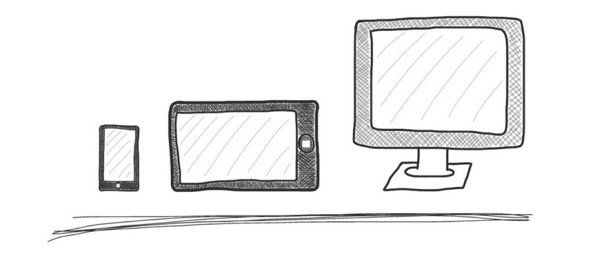

Web Page Layouts
================

The the generic word **"layout"** identifies **how box contents should be arranged** in relation to the available space.

> We can talk about the layout of any box within a web page, 
> but the pourpose of this article is to circumscribe the discussion 
> to the overall **layout of a web page**. 

In any web page we can identify **a box which seems to wrap around all the page's contents**. We should call this box **"main container"** because by analyzing this box we can **identify the web page layout**.

> When we talk about **"web page layout"** then we mean **how the page's 
> main container behave responding to the _viewport_'s behaviour**.
>
> <small>The _**web page's viewport**_ is the portion of the browser's 
> window available to page's contents to be rendered.</small>

There are _two main families_ of web page layouts - **boxed layouts** and **fluid layouts** - with which we identify two radical different approaches in using viewport's available space. 

We can also mix those main families to obtain many different **hybrid layouts** whom combine properties from both original families.

## Boxed Layout

This is the most common _web page layout_ because it's quite simple to deal with. It's main property is the **fixed dimension of the main container** which make possible to set very precise dimensions for images, columns and other UI components.

    // HTML
    

        
Box A

        
Box B

    

    
    // CSS
    .container {
        width: 800px;
        margin: auto;
    }
    .content {
        width: 100%;  /* optional */
    }

The most of the time this layout appear to be a paper centered to the browser's viewport. The content's background contrasts that much with the overall background and very often a border is visible.

> It is easy to identify this layout when you try to resize your browser's window:  
> **content's width persists while outer horizontal margins change**.

A boxed layout is very often used for _web sites_ and _landing pages_, mostly because dimensions inside the content wrapper never change so **it is possible to cut out very articulated graphics** into slices and put all toghether inside an nested _HTML_ structure.

## Fluid Layout

In a _fluid layout_ **content'ss dimensions follow the viewport dimensions**. Contents fill all available horizontal space and adapt from very little to very large _viewport_ sizes.

> This is the layout of _web apps_ and _mobile web sites_. 

A **web app** - like _GMail_ - needs to display a lot of things: menus, panels, informations boxes, contents so it needs all the available space to be exploited in a very clever way. 

On the other side a **mobile web site** needs to display very simple contents to a very narrow screen so it also needs all available space to be used the best possible way.

    // HTML
    

        
Box A

        
Box B

    

    

        
Box C

        
Box D

    

    
    // CSS
    .container {
        width: auto;
        margin-left: 50px;
        margin-right: 50px;
    }

In above code we use some _containers_ which spread to all available horizontal space but for a fixed margin. Then we can use those containers to implement some left/right columns with _float_ or _flexbox_ <small>(not implemented into this example code)</small>.

A fluid layout is quite difficult to implement in a _web page_ who's target is the _desktop enviroment_ because very large text contents are quite difficult to read. When a text box becomes too large then the _page usability_ should decrease to the point which it is impossible to read the page!

> Most of the time **this layout is implemented with _CSS Media Queries_** to 
> better respond to many different device sizes.
> 
> This is called **Responsive Design**.

## Fluid Boxed Layout

This is probably the most implemented **hybrid layout** which is used today by literally millions of websites.

It's pourpose is to create the illusion of a _fluid layout_ but preserving the "easy of use" of a _boxed layout_.

It fits very well a web page which should be vertically split into many areas, each area to be a fluid box wich contains the _boxed layout_'s container.

- there should be many "main containers"
- _main container_ has dynamic width (filling the _viewport_)
- each _main container_ has an **inner wrapper** wich has _boxed layout_ properties

    // HTML
    

        
Box A

    

    

        
Box B

    

    
    // CSS
    .container {
        width: auto;
    }
    .content {
        width: 800px;
        margin: auto;
    }
    

## Responsive Layouts

We have talked about _"media queries"_ which is a _CSS_ strategy to apply **conditional styles** to page's content boxes.

This tecnology applies to the _web page layout_ problem very well because allow you to create a page structure **behave fluid on little screen sizes but then become boxed on big screens** <small>(this is only an example of many possible _responsive behaviours_)</small>.

This is called a **responsive layout** because it's behaviour (so it's name) depends on _viewport_'s dimension. 

> Almost every modern _web site_ and _web apps_ implement this strategy/technology
> to allow all kind of users to **enjoy the best possible user experience** with the page.

